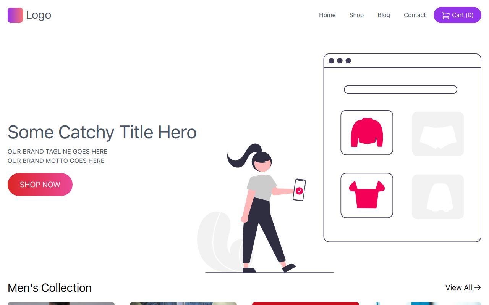

# E-Commerce Shop

## Overview

Welcome to the E-Commerce Shop project, a sleek and functional e-commerce website created for an online shopping experience. This project is crafted with HTML and Tailwind CSS, providing a responsive and stylish interface for users to explore and purchase products.


### Table of Contents

- [Installation](#installation)
- [Usage](#usage)
- [Technologies Used](#technologies-used)
- [Features](#features)
- [Project Structure](#project-structure)
- [Credits](#credits)
- [License](#license)



## Installation

To run this project locally, follow these steps:

1. Clone the repository to your local machine.
    ```bash
    git clone https://github.com/ramzancodeclub/E-Commerce.git
    ```

2. Open the project folder in your code editor.

3. Open the `index.html` file in your web browser.

## Usage

To explore the E-Commerce Shop:

1. Open the [live demo](https://e-commerce-green-omega.vercel.app/) or run it locally.

2. Browse through the product listings and experience the responsive design.

## Technologies Used

- HTML
- Tailwind CSS (Link to the library)

## Features

- **Product Listings:** Display a variety of products with detailed information.

- **Responsive Design:** Ensures a seamless shopping experience across various devices.

- **Tailwind CSS:** Utilizes the power of Tailwind CSS for streamlined and efficient styling.

## Project Structure

The project is structured to facilitate easy navigation through different product categories and an intuitive shopping experience.

## Credits

I would like to acknowledge the following resources and tools that contributed to the success of this project:

- Tailwind CSS: [Tailwind CSS](https://tailwindcss.com/)

## License

This project is licensed under the [MIT License](LICENSE). Feel free to use and modify the code as per the license terms.

---

## Badges


## Feedback and Contributions

If you have any feedback or would like to contribute to the project, follow these steps:

1. Fork the project.
2. Create a new branch for your contribution: `git checkout -b feature-name`.
3. Commit your changes: `git commit -m 'Add new feature'`.
4. Push to the branch: `git push origin feature-name`.
5. Open a pull request.

## Contact

If you have any questions, suggestions, or just want to connect, feel free to reach out:

- Email: [ramzancodeclub@gmail.com](ramzancodeclub@gmail.com)
- Portfolio: [muhammad-ramzan.vercel.app](https://muhammad-ramzan.vercel.app/)
- LinkedIn: [in/ramzancodeclub](https://www.linkedin.com/in/ramzancodeclub/)

## Tests

The project includes a set of tests to ensure the functionality is working as expected. To run the tests, use the following command:
```bash
npm test
